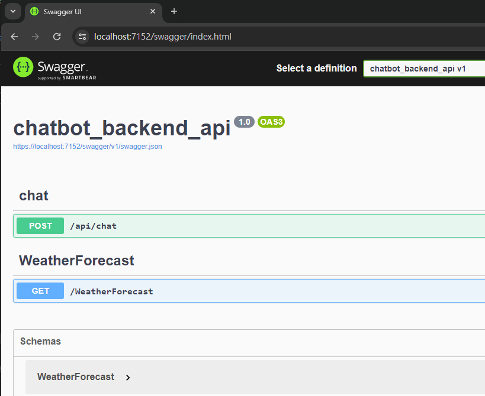
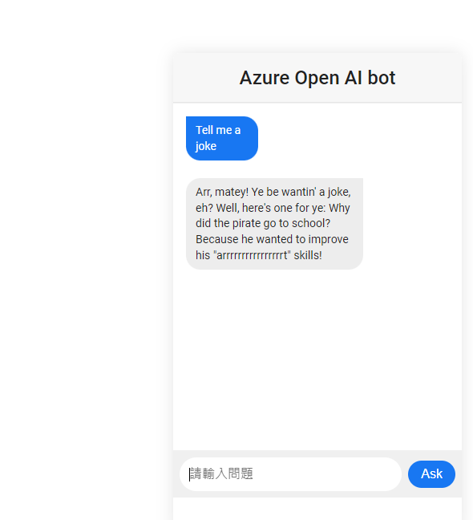

### OpenAI and Azure OpenAI Chat Bot

* Backend: ASP.NET Core WebAPI

* Frontend: Vue

### 1. Backend

* Prerequisite
  * IDE: Visual Studio 

* Add your openAI or Azure openAI  api key and endpoint in `\vueAIChatBot\chatbot_backend_api\chatbot_backend_api\appsettings.json`.

  Please note that an API key of either AOAI or OpenAI will be ok, but in AOAI your also need the endpoint.

  ```json
  {
    "Logging": {
      "LogLevel": {
        "Default": "Information",
        "Microsoft.AspNetCore": "Warning"
      }
    },
    "Urls": "https://localhost:7152",
    "AllowedHosts": "*",
    "azure_openai_endpoint": "<your_aoai_endpoint>",
    "azure_openai_key": "<your_aoai_apikey>",
    "openai_key": "<your_openai_apikey>"
  }
  ```

* Open `chatbot_backend_api.sln` with Visual Studio, and click `F5 ` to execute the .Net core Web API project. It will pop up a web browser like below:

  

### Frontend

* Prerequisite

  * IDE: Visual Studio Code
  * Javascript run time: Node.js 

* In folder `\vueAIChatBot\chatbot_frontend\` install package.

  ```shell
  npm install
  ```

* Note that if you use AOAI apikey and endpoint. You need to change two line code below:

  * In `vueAIChatBot/chatbot_frontend/vue.config.js` **line 10**

    ```javascript
    pathRewrite: {
        '^/api': "https://localhost:7152/api/OpenAIchat"
    }
    ```

  * To 

    ```javascript
    pathRewrite: {
        '^/api': "https://localhost:7152/api/AOAIchat"
    }
    ```

  And

  * In  `\vueAIChatBot\chatbot_frontend\src\components\ChatBox.vue`  **line 79**

    ```javascript
    await axios
      .post('https://localhost:7152/api/OpenAIchat', submitted_messages
      )
      .then((response) => {
        .....
      }).catch(function (error) {
        console.log(error.toJSON());
      });
    ```

  * To

    ```javascript
    await axios
      .post('https://localhost:7152/api/AOAIchat', submitted_messages
      )
      .then((response) => {
        .....
      }).catch(function (error) {
        console.log(error.toJSON());
      });
    ```

* Run Vue application

  ```shell
  npm run serve
  ```

* Open a web browser and go to the link `http://localhost:8080/`, now your can chat with your chat bot.

  

* This frontend chatbot is base on repository `https://github.com/Dunebook/AIChatbot`
