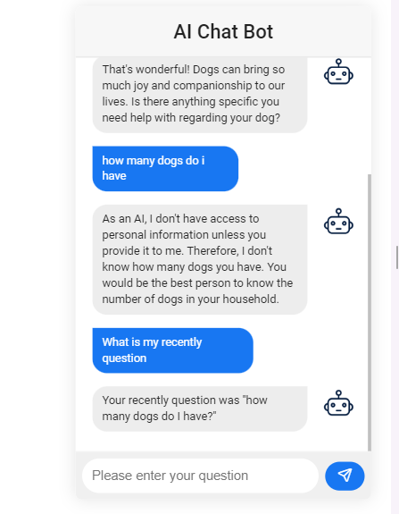

### Azure OpenAI  Chat Bot

* Backend: ASP.NET Core WebAPI

* Frontend: Vue

### 1. Backend

* Prerequisite
  * IDE: Visual Studio 

* add your api key and endpoint in `\VueChatBot\chatbot_backend_api\chatbot_backend_api\appsettings.json`

  ```json
  {
    "Logging": {
      "LogLevel": {
        "Default": "Information",
        "Microsoft.AspNetCore": "Warning"
      }
    },
    "AllowedHosts": "*",
    "Urls": "https://localhost:7152",
    "endpoint": "<your_endpoint>",
    "key": "<your_apiKey>"
  }
  ```

* Open `chatbot_backend_api.sln` with Visual Studio, and click `F5 ` to execute the .Net core Web API project. It will pop up a web browser like below:

  

### Frontend

* Prerequisite

  * IDE: Visual Studio Code
  * Javascript run time: Node

* In folder `\VueChatBot\chatbot_frontend\` install package.

  ```shell
  npm install
  ```

* Run Vue application

  ```shell
  npm run serve
  ```

* Open a web browser and go to the link `http://localhost:8080/`, now your can chat with your chat bot.

  

* This frontend chatbot is base on repository `https://github.com/Dunebook/AIChatbot`
